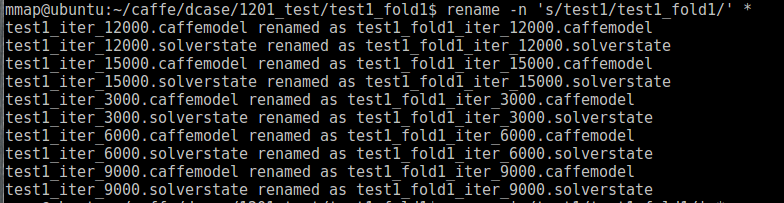
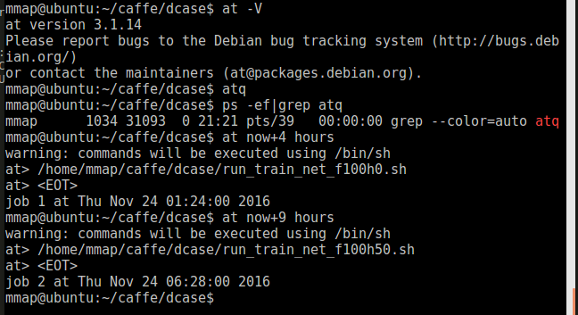

# print home 
```
echo $HOME
```

<!--more -->
# rename 
* mv
	```
	linux下重命名文件或文件夹的命令mv既可以重命名，又可以移动文件或文件夹.

	例子：将目录A重命名为B

	mv A B

	例子：将/a目录移动到/b下，并重命名为c

	mv /a /b/c
```

* rename

rename the file with test1 into test1_fold1
	rename 's/test1/test1_fold1/' *




# at


		
	sudo vi /etc/at.allow  -- add user
	at now+3 minutes
	/home/mmap/lu/task1_dataset/test_at.sh
	crtl+D save and exit

# tar
* compress
	tar -zcvf cpickle_mixdownf100h0_out6.tar.gz cpickle_mixdownf100h0_out6

* decompress
	tar -zxvf *.tar.gz	


# cp
copy one file into multiple dirs
	for i in `ls -d */*`;do cp mnist.prototxt $i;done


# shell

1、将当前目录下包含jack串的文件中，jack字符串替换为tom
```

sed -i "s/jack/tom/g" `grep "jack" -rl ./`
```
2、将某个文件中的jack字符串替换为tom
```
sed -i "s/jack/tom/g" test.txt
```

* practice

```
# replace.sh
#!/usr/bin/env sh
#1、将当前目录下包含dcase3串的文件中，dcase3字符串替换为dcase3

sed -i "s/dcase3/dcase5/g" `grep "dcase3" -rl dcase2`
```
```
explanation
#其实就是一个sed 命令  ：  sed -i "s/oldstring/newstring/g" "包含oldstring的文件"

 -i 在文件中直接替换，而不是输出到终端
 
  "s/oldstring/newstring/g"  替换字符串的语法，后面的g表示替换所有的

# 而其中包含oldstring的文件是同过 grep "oldstring" -rl  path 这条命令找出来的
                 -r：在目录中递归查找
 
                -l: 输出找到包含oldstring 的文件名

```

# nohup

	nohup python Wav2Image.py > wav2images1101.txt 2>&1 &

## matlab 

	nohup matlab -nojvm -nodisplay -nosplash -nodesktop < *.m 1>log.txt 2>error.txt &